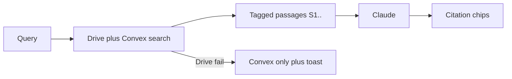

# Ask & Search Deep Dive Plan

## Diagnosis

Ask an Expert already ships federated Drive + Convex retrieval, citations (`ask-citations`), and record tools (`ask-record-tools`). Gaps vs “industry leading” are **trust** (wrong-but-valid citations), **clarity when Drive is unavailable**, **hangs**, and **cost** (tool loops, company fan-out)—not a missing search stack.

## Goals

1. Answers that are **provably grounded** (faithful citations, clear when manuals weren’t searched).
2. **No silent hangs** — hard budget to first token with actionable recovery.
3. **Same retrieval quality story** in Ask and Ctrl+K content mode.
4. **Hard cost caps** on expensive Ask turns.

## Design principles

- Keep federated Drive + Convex path; soft-fail Drive, never block Ask forever.
- No silent GIS popups on Ask auto-path (already policy).
- Ship behind flags where latency/cost tradeoffs are real (e.g. Ask rerank).

---

## Phase 1 — Trust & degrade UX (P0)

### 1a. Citation faithfulness
- After stream (or on chip click prep): score claim ↔ excerpt for each cited `[S#]`
- Demote/strip weak tags; keep anti-hallucination strip for unknown tags
- Surface under-cited answers more strongly than today’s soft notice

Key: [`src/types/askSources.ts`](src/types/askSources.ts), Splash/AskPanel render path, [`docs/ask-an-expert-spec.md`](docs/ask-an-expert-spec.md)

### 1b. Drive-not-searched chip
- Persist per-turn badge when `driveUnavailable` / index missing: “Drive manuals not searched”
- Deep-link to Settings Test Drive / Library coverage — not toast-only

Key: [`SplashPage.tsx`](src/components/SplashPage.tsx), [`AskPanel.tsx`](src/components/ask/AskPanel.tsx), [`driveSearchIntegration.ts`](src/services/driveSearchIntegration.ts)

### 1c. Hang SLA
- Single timeout budget: index wait + retrieval + first Claude token
- Cancel in-flight work; show actionable error (Reconnect Drive / Refresh index / Retry)
- Regression tests for abort + generation race (already partially hardened)

---

## Phase 2 — Retrieval quality (P1)

### 2a. Aviation query expanders
- Cheap pre-embed expansion: PN / AD / ATA / common synonyms
- Shared by Ask + Global content + Library search

### 2b. Optional Ask rerank
- Feature flag: enable Voyage (or existing) rerank when candidate pool disagreement is high / latency budget allows
- Default off for cost; Library/Global can keep current behavior

### 2c. Global Search parity
- Content mode: same hybrid labels (`matchType`, score) as Library
- Show Drive/coverage status in content footer
- Keep deep-link `/library?doc=` (already shipped)

---

## Phase 3 — Cost control (P2)

### 3a. Ask turn spend caps
- Cap tools × tokens per turn (reuse DCT spend-limit pattern)
- Clear user message when cap hit

### 3b. Scope defaults
- Prefer active project retrieval; company fan-out only when explicitly scoped / fewer projects
- Cache query embeddings across Splash + Ctrl+K session more aggressively

### 3c. Telemetry
- Sample `askPerf` / citation rate in production (not DEV-only)
- Simple admin or PostHog metrics for ≥90% cited-answer bar

---

## Out of scope

- Full Ask rewrite / new vector DB
- Cross-device cloud chat history (later)
- Server-side Drive index cron (Library/Drive Phase 3)

## Suggested build order

| Sprint | Deliverable |
|---|---|
| 1 | Drive-not-searched chip + hang SLA |
| 2 | Citation faithfulness pass |
| 3 | Query expanders + optional Ask rerank flag |
| 4 | Global Search parity + spend caps + telemetry |

## Success criteria

- User always knows if Drive manuals were searched for that answer
- Ask never spins indefinitely without a cancel/error path
- Weak citations are stripped or flagged; citation rate measurable
- Ctrl+K content ranking feels consistent with Ask/Library
- Spend caps prevent runaway tool loops

## Key files

- [`src/components/SplashPage.tsx`](src/components/SplashPage.tsx)
- [`src/components/ask/AskPanel.tsx`](src/components/ask/AskPanel.tsx)
- [`src/services/driveSearchIntegration.ts`](src/services/driveSearchIntegration.ts)
- [`src/components/GlobalSearch.tsx`](src/components/GlobalSearch.tsx)
- [`convex/documentChunks.ts`](convex/documentChunks.ts)
- [`docs/ask-an-expert-spec.md`](docs/ask-an-expert-spec.md)
