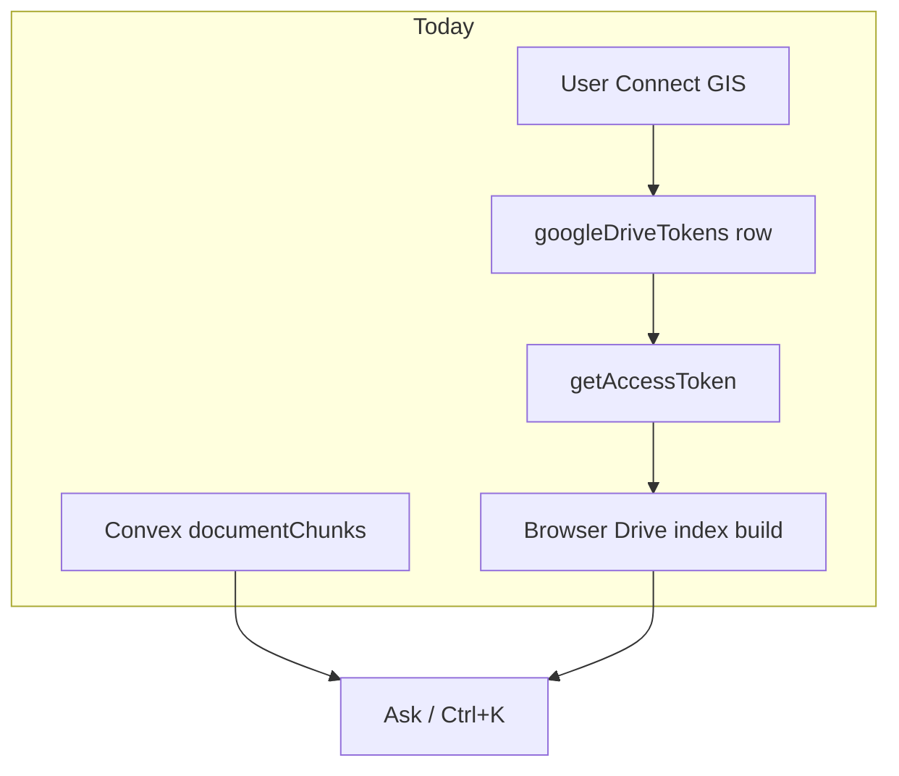

# Library / Drive Deep Dive Plan

## Diagnosis

Drive is already designed to survive reload via a **server-stored refresh token** ([`convex/googleDriveAuth.ts`](convex/googleDriveAuth.ts)). Forced reconnect is almost never hourly access-token expiry — it is:

1. Google OAuth app left in **Testing** (~7-day refresh expiry) — documented in Settings and auth module header
2. Dead refresh grant (`invalid_grant` → token row cleared)
3. Missing Convex `GOOGLE_CLIENT_*` env
4. UI treating **row exists** (`hasConnection`) as **grant is healthy**

Bulk refresh is half-built: Company Library can checkbox-select and Convex-reindex groups, but **Drive subset refresh and folder-level Convex reindex** already exist in Entity/Admin Library and are missing from the primary Company Library surface users actually use.

## Goals

1. **Always-on Drive (user-facing):** Connect once; stay connected across sessions without weekly reconnect, with clear health status when the grant dies.
2. **Bulk refresh (user-facing):** Select any group of library docs (checkboxes, manual group, folder) and refresh the **correct** index store in one action.

## Design principles

- Keep per-user OAuth (no domain-wide service account in this plan).
- Do not reintroduce silent GIS popups on every refresh.
- Reuse Entity/Admin patterns in Company Library — no new bulk APIs.
- Distinguish Convex chunk reindex vs Drive `.aqv.json` refresh in UI so no-copy Drive links are not “refreshed” as a no-op.

---

## Phase 1 — Always-on Drive (connection health)

### 1a. Ops checklist (required for Production)
Document and verify in deploy runbook / Settings help:

- Google Cloud OAuth consent screen is **In production** (not Testing)
- Convex env has `GOOGLE_CLIENT_ID` + `GOOGLE_CLIENT_SECRET` matching the web client
- Authorized origins / redirect (`postmessage` for GIS) are correct for prod domain

Surface a Settings banner when Convex reports auth configured but mint fails repeatedly (not just “Connected”).

### 1b. Connection health probe
Add Convex query/action path (extend [`convex/googleDriveAuth.ts`](convex/googleDriveAuth.ts)):

- `probeConnection` — attempt refresh mint (or lightweight Drive `about.get`); return `{ status: 'ok' | 'needs_reconnect' | 'not_connected' | 'misconfigured', detail? }`
- Do **not** clear the refresh token on transient network errors; keep clearing only on confirmed `invalid_grant`

Settings [`IntegrationsSection.tsx`](src/components/settings/sections/IntegrationsSection.tsx):

- Replace binary Connected with: **Connected**, **Needs reconnect**, **Not connected**, **Server misconfigured**
- Keep existing Testing-mode copy; strengthen it to “Weekly reconnect means the Google app is still in Testing”

Ask / Splash reconnect toast: only offer Reconnect when probe says `needs_reconnect`, not on soft Drive-unavailable for unrelated reasons when possible.

### 1c. Hydration reliability (small code)
Confirm [`AuthGate.tsx`](src/components/AuthGate.tsx) + [`driveAuthBridge.ts`](src/services/driveAuthBridge.ts) + proactive refresh in [`googleDrive.ts`](src/services/googleDrive.ts) remain the only auto path. Add a single Settings “Test Drive connection” button that runs the probe (mirrors Avianis Test connection).

**Out of scope this phase:** company-shared Drive tokens, Drive push webhooks, server cron file sync.

---

## Phase 2 — Bulk refresh (Company Library parity)

### 2a. Selection-scoped Drive refresh
In [`CompanyLibrary.tsx`](src/components/CompanyLibrary.tsx) selection toolbar (alongside existing `Re-index N`):

- Add **Refresh Drive index (N)** using existing [`RefreshSearchIndexButton`](src/components/RefreshSearchIndexButton.tsx) / `buildProjectDriveIndex({ documentIds })` — same pattern as Entity Library
- Enable when selection includes external / no-copy Drive refs (from index summary or doc flags)

### 2b. Folder-level Convex reindex
When a library folder is selected (and no checkboxes), add **Reindex this folder** → `backfillAll({ folderId, force: true, categories })` — copy Admin/Entity.

### 2c. Force refresh on already-indexed rows
Per-row **Re-index** today only shows for `failed` / `eligible`. Allow **Force refresh** for `indexed` as well (or always show Re-index with force), matching bulk `force: true` behavior.

### 2d. Smart “Refresh” for selection (optional polish in same PR)
One primary **Refresh selected** that:

1. Queues Convex `backfillAll({ force, documentIds })` for docs with Convex text
2. Runs Drive subset refresh for external refs
3. Toasts a short summary (“Queued 12 for reindex · Refreshed 3 Drive docs”)

### 2e. Logbooks (light touch)
[`LogbooksLibraryTab.tsx`](src/components/LogbooksLibraryTab.tsx): add **Re-index selected** using the same `backfillAll` + documentIds pattern (parse selection already exists).

---

## Phase 3 — Always-on search freshness (server-side Drive index)

**Goal:** Keep Drive vector index fresh without requiring the Library tab open all day.

- Convex action (authenticated as the connecting user, or scheduled with stored refresh): rebuild/update project Drive index server-side using `googleDriveAuth.getAccessToken` internals
- Cron or “stale after N hours” trigger per company/project that has linked Drive manuals
- Rate-limit per user; write `.aqv.json` back to the user’s Assessment Analyzer folder (same as client today) **or** store index blob in Convex if Drive write proves fragile

Ship Phase 1–2 first; Phase 3 only after Production OAuth + health probe are verified in prod.

---

## Suggested build order

| Sprint | Deliverable |
|---|---|
| 1 | Probe + Settings status + Test connection + Testing banner clarity |
| 2 | Company Library: Drive refresh for selection, folder reindex, force row refresh |
| 3 | Smart Refresh selected + Logbooks reindex selected |
| 4 | Server-side Drive index refresh (cron/action) |

## Success criteria

- User Connects once on Production OAuth and does not need weekly reconnect
- Settings clearly shows Connected vs Needs reconnect vs Misconfigured
- From Company Library, user can select a manual group or folder and refresh Convex and/or Drive indexes without going to Admin
- No-copy Drive docs refresh via Drive path, not a silent Convex no-op
- Help docs mention the two index systems and when to use each

## Key files

- [`convex/googleDriveAuth.ts`](convex/googleDriveAuth.ts)
- [`src/services/googleDrive.ts`](src/services/googleDrive.ts)
- [`src/services/driveSearchIntegration.ts`](src/services/driveSearchIntegration.ts)
- [`src/components/settings/sections/IntegrationsSection.tsx`](src/components/settings/sections/IntegrationsSection.tsx)
- [`src/components/CompanyLibrary.tsx`](src/components/CompanyLibrary.tsx)
- [`src/components/RefreshSearchIndexButton.tsx`](src/components/RefreshSearchIndexButton.tsx)
- [`src/components/LibraryManager.tsx`](src/components/LibraryManager.tsx) (reference pattern)
- [`convex/documentChunks.ts`](convex/documentChunks.ts) (`backfillAll`)
