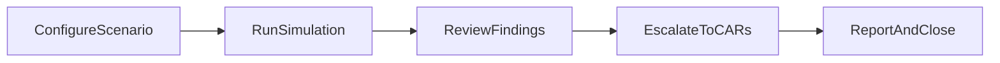

# Audit Simulation

Route: `/audit`  
Component: `src/components/AuditSimulation.tsx`  
Primary backend: `convex/simulationResults.ts`, `convex/entityIssues.ts`

## What this page does

Audit Simulation runs multi-agent audit sessions against project evidence, supports pause/resume workflows, and lets users promote discrepancies into CARs/issues.

## Steps

1. Configure simulation context and start a run.
2. Pause, resume, or stop the run as needed.
3. Attach supporting files/images during execution.
4. Save run snapshots (draft/final) and reload prior sessions.
5. Convert findings into entity issues.
6. Delete obsolete simulations.

## Screenshots

> Warning: Do not escalate all findings blindly; review severity and evidence quality before pushing to CARs/issues.

## Workflow visual

## Key functions and behavior

- `handleStart()`  
  Starts a new simulation run with current options and project context.
- `handlePause()` / `handleResume()` / `handleStop()`  
  Control execution state without losing run context.
- `handlePauseFileSelect(event)` / `handleImageAttach(event)`  
  Inject additional evidence while paused or active.
- `handleSaveSimulation(asDraft?)`  
  Persists current run state to project simulation history.
- `handleLoadSimulation(simId)`  
  Loads a previously saved run state into the UI.
- `handleAddAllToEntityIssues()`  
  Pushes simulation discrepancies into the CAR/issue system.
- `handleDeleteSimulation(simId)`  
  Removes a saved run record.
- `handleAuditorQuestionAnswer(answer)`  
  Applies user answer data to interactive auditor prompts.

## Data dependencies

- Simulation history, fetch, save, delete in Convex.
- Shared/project agent KB sources for context.
- Entity issue mutation for escalation.

## Outputs and downstream links

- Saved simulation artifacts for comparison and reporting.
- Escalated issues visible in `/entity-issues` and command center metrics.

## Troubleshooting

- Missing project context: pick active project first.
- Incomplete evidence set: import required docs from `/library`.
- Save/load mismatch after schema changes: rerun simulation with current config.

## Related guides and next step

- Related: [Library and Document Ingestion](./library-and-document-ingestion.md), [Issues, Command Center, and Analytics](./issues-command-center-and-analytics.md), [Paperwork Review](./paperwork-review.md)
- Next step: Escalate validated findings and monitor closure in the command center.
