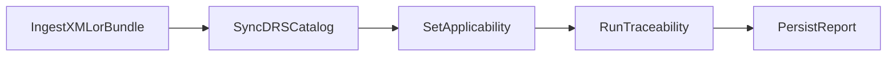

# DCT Compliance

Route: `/dct-compliance`  
Component: `src/components/DctCompliance.tsx`  
Primary backend: `convex/dctCompliance.ts`

## What this page does

DCT Compliance ingests SAS Standard DCT data, runs traceability checks against manuals/evidence, tracks scheduled check completion, and generates reports.

## Steps

1. Ingest DCT XML files (file list or folder) or JSON bundle fallback.
2. Sync DCT documents from shared reference library.
3. Paste DRS identifiers and sync catalog metadata.
4. Save applicability settings.
5. Run traceability analysis.
6. Complete scheduled check cycle.
7. Generate PDF and persist report records.

## Screenshots

> Warning: Ensure applicability settings are saved before traceability runs, otherwise result sets may be broader than intended.

## Workflow visual

## Key functions and behavior

- `handleXmlFilesFromList(files, sourceLabel)`  
  Parses XML locally, batches valid payloads, ingests chunks through Convex.
- `handleJsonBundleFile(file)`  
  Accepts JSON fallback data and ingests with same batching path.
- `handleSyncFromReferenceLibrary()`  
  Pulls DCT sources from shared library and ingests to active project.
- `handleDrsPaste()`  
  Uses pasted DRS data to sync catalog state.
- `handleSaveApplicability()`  
  Stores applicability selections used in traceability filtering.
- `handleRunTraceability()`  
  Executes traceability and applies results in bulk.
- `handlePdf()`  
  Generates downloadable PDF from current traceability state.
- `handlePersistReport()`  
  Writes report artifact metadata for project history.
- `completeCheck({ projectId })`  
  Advances next due date after check completion.

## Data dependencies

- DCT ingestion and sync mutations in `convex/dctCompliance.ts`.
- Shared reference library for seeded DCT XML sources.
- Active project context from app store for all operations.

## Outputs and downstream links

- Ingested DCT corpus and traceability results.
- Completed check cadence state.
- Persisted reports and downloadable PDF.

## Troubleshooting

- XML parse errors: invalid files are skipped and reported.
- Large payload ingest interruption: chunk-level retry handles partial failures.
- Traceability run blocked: confirm project, applicability, and ingested docs.

## Related guides and next step

- Related: [Library and Document Ingestion](./library-and-document-ingestion.md), [Manual Authoring, Management, and Revisions](./manual-authoring-management-and-revisions.md)
- Next step: Persist the report and review open gaps with your manual/revision owners.
