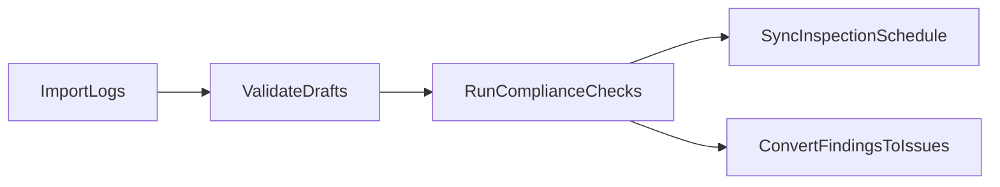

# Logbook and Inspection Schedule

Route: `/logbook` (plus `/schedule` redirect)  
Component: `src/components/LogbookManagement.tsx`  
Primary backend: `convex/logbookEntries.ts`, `convex/logbookDraftEntries.ts`, `convex/inspectionSchedule.ts`, `convex/complianceFindings.ts`

## What this page does

Logbook Management handles aircraft logbook ingestion, draft review/import, compliance checks, findings-to-issue conversion, and schedule synchronization.

## Steps

1. Upload one or many logbook files.
2. Review parsed draft entries.
3. Import selected drafts into final entries.
4. Delete unwanted drafts or source documents.
5. Run compliance checks and detect chronic findings.
6. Sync entry-driven schedule updates.
7. Export data (CSV) and use review prompts.

## Screenshots

> Best practice: Complete draft cleanup before running checks and schedule sync so due logic is based on finalized entries.

## Workflow visual

## Key functions and behavior

- `handleUpload()` / `processSingleUploadFile(file, clientId)`  
  Parses source files and builds draft entries for user validation.
- `handleImportSelected()`  
  Commits selected draft rows into canonical logbook entries.
- `handleDeleteSelectedDrafts()` / `handleDeleteSingleDraft(draftId)`  
  Removes unwanted draft imports.
- `handleDeleteDocument(doc)`  
  Deletes a logbook source document.
- `handleRunChecks()`  
  Runs compliance rule checks against current entries/components.
- `handleDetectChronic()`  
  Flags recurrence patterns in findings.
- `handleConvertToIssue(finding)`  
  Escalates compliance findings to entity issues.
- `handleSyncSchedule()`  
  Calculates schedule updates (`buildScheduleUpdates`) and persists sync.
- `buildLogbookCSV(entries, tailNumber)` / `triggerDownload(content, filename)`  
  Creates CSV export content and initiates browser download.

## Data dependencies

- Logbook entries/drafts, components, findings, and schedule datasets from Convex.
- CSV import helpers (`parseCSV`, mapping, preview) for structured imports.
- Integration service (`logbookIntegration`) for issue/schedule bridging.

## Outputs and downstream links

- Finalized logbook entries.
- Compliance findings and escalated issues.
- Updated inspection schedule.
- CSV exports for external review.

## Turning Logbook on

Logbook stays off until an admin enables it. The app does not turn it on by itself, and Settings has no switch for it.

1. **Company policy (wins when it is saved).** A company admin or company manager opens **Company Admin** (`/company-admin`), selects the organization, checks **Logbook enabled**, and clicks **Save Policy**. A platform admin can do the same under **Admin → Companies**. Saving the box unchecked turns Logbook off for every member, even if a per-user switch is on. The QM Core preset saves it off; Full platform saves it on. Leaving the company value unset (never saved) does not enable Logbook.
2. **Per user (only when the company has no Logbook value).** A platform admin opens **Admin → Users** (`/admin?tab=users`) and sets **Logbook: Enabled** for that person. Unset or Disabled means off.

`/logbook` shows these steps when the module is off. `/logbook/entry-review` stays reachable either way. Fleet uses the same entitlement and explains the same path if you open it while Logbook is off.

Entry Review calls the shared AI credential lookup. If it reports that `AI_CREDENTIAL_SERVICE_TOKEN` is not set, an operator sets the same secret in the app server and in Convex. See [AI provider credentials](../ai-credentials.md). Do not commit the token.

## Troubleshooting

- Module disabled: follow **Turning Logbook on** above. A toast that only says to ask an administrator is not the only signal — `/logbook` states who can flip the switch.
- Parse/mapping errors: fix field mapping or source format and retry upload.
- Schedule sync mismatch: run checks/import first, then sync.

## Related guides and next step

- Related: [Checklists and Recurring Cycles](./checklists-and-recurring-cycles.md), [Issues, Command Center, and Analytics](./issues-command-center-and-analytics.md)
- Next step: Run compliance checks and convert actionable findings into issues.
